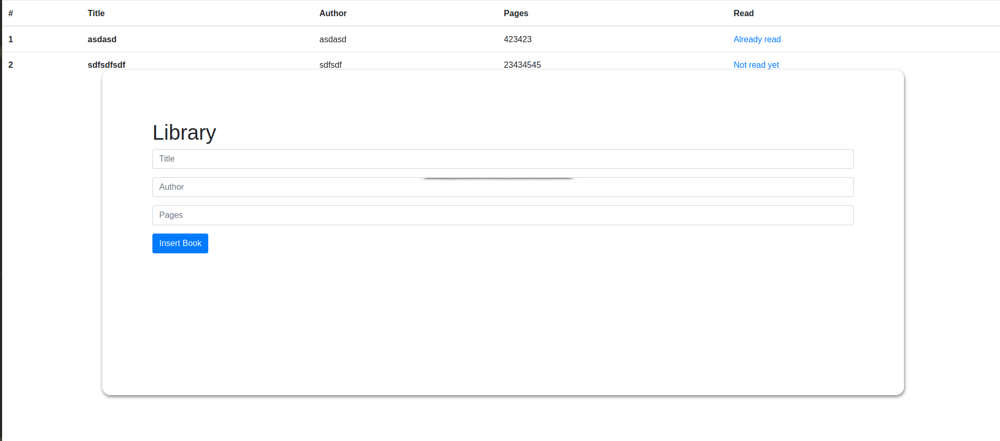

# Library

The purpose of this project is to learn javascript by creating a virtual library of books that a user has or not read, we can add a new book and update the status.

## Built With

- HTML
- CSS
- JavaScript
- ESLint
- Prettier

## Preview

## Authors

👤 **Miguel Dubois**

- Github: [@MiguelDP4](https://github.com/MiguelDP4)
- Twitter: [@Mike_DP4](https://twitter.com/Mike_DP4)
- LinkedIn [Miguel Dubois](https://www.linkedin.com/in/miguel-angel-dubois)

👤 **Ruben Paz Chuspe**

- Github: [@rubenpazch](https://github.com/rubenpazch)
- Linkedin: [rubenpch](https://www.linkedin.com/in/rubenpch/)
- Twitter: [chuspepaz](https://twitter.com/ChuspePaz)

## 🤝 Contributing

This project is for learning purposes only, we wont accept contributions, though suggestions are welcome.

## Show your support

Give a ⭐️ if you like this project!

## Acknowledgments

- We thank microverse for this learning opportunity.